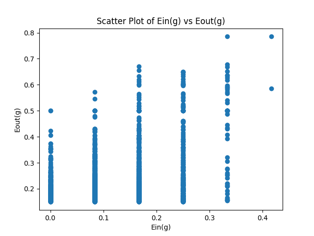

## Question 5

GPT suggested that there is a sequence 1, 4, 9 with $N = 2$. However, if $N = 2$, we only know the first $N - 1$ term, which is just a single number, so it’s not possible to generate multiple equations, such as the sequence 1, 4, 9. With only one known term, we cannot solve for the three coefficients of a quadratic polynomial. Therefore, I disagree with GPT's final answer.

However, in GPT's example, there are $N + 1$ terms of an integer sequence. We can list $N + 1$ polynomial equations and represent them as a matrix equation $A x = b$, where $A$ is formed by all the input values from $x^0, x^1, \dots, x^n$, and $x$ takes values from 1 to $N + 1$. $A$ is a Vandermonde matrix. The vector $x$ is a one-dimensional matrix that contains all the coefficients, such as $a_0, a_1, \dots, a_n$. The vector $b$ is also one-dimensional, containing all the solutions of the equations. Because the Vandermonde matrix is invertible, we can solve for the coefficients using $x = A^{-1}b$. Since the dimension of the null space of $x$ is zero, we get a unique solution for the coefficients. So, I agree with GPT's example but not with GPT's final answer.


## Question 6

$$
\text{P(one specific number is green)} = \frac{1}{2} \\
$$

$$
\text{P(one specific number all green on 5 cards)} = \left(\frac{1}{2}\right)^5 = \frac{1}{32} \\
$$

$$
\text{P(one specific number not all green on 5 cards)} = 1 - \frac{1}{32} = \frac{31}{32} \\
$$

$$
\text{P(16 numbers are not all green on 5 cards)} = \left( \frac{31}{32} \right)^{16} \\
$$
$$
\text{P(there are some numbers that are green on 5 cards)} = 1 - \text{P(16 numbers are not all green on 5 cards)} \\ = 1 - \left( \frac{31}{32} \right)^{16} \\
$$

## Question 7

$$
\text{P(pick one green 5's)} = \frac{1}{2} \\
$$

$$
\text{P(pick 5 green 5's)} = \left(\frac{1}{2}\right)^5 = \frac{1}{32}
$$

## Question 8

$$
\text{Since there are M machines and a total of t pulls, the size of the hypothesis set number is } Mt.  \text{And } E_{\text{out}} = \mu_m, \, E_{\text{in}} = \frac{c_m}{N_m}. \\
$$

$$
\text{Let } P(\text{bad at t}) = P\left(\mu_m > \frac{c_m}{N_m} + \sqrt{\frac{\ln t - \frac{1}{2} \ln \delta}{N_m}}\right). \\
$$

$$
\sum_{t=1}^{\infty} \delta t^{-2} \geq \sum_{t=1}^{\infty} P(\text{bad at t}) \geq P(\text{bad at t = 1 or bad at t = 2} \dots \text{bad at t = } \infty) \\
$$

$$
\text{because} \quad \sum_{t=1}^{\infty} \delta t^{-2} = \frac{\pi^2}{6} \delta > \sum_{t=1}^{\infty} P(\text{bad at t}). \\
$$

$$
\text{Thus, } P(\text{bad at t}) \text{ will be constrained to a certain value and will not approach infinity}. \\
$$

$$
\sum_{t=1}^{\infty} P(\text{bad at t}) \geq P(\text{bad at t = 1} \, \text{or} \, \dots \, \text{bad at } \infty). \\
$$

$$
\text{We can get:} \\
$$

$$
P\left(\mu_m > \frac{c_m}{N_m} + \epsilon\right) \leq 2 \cdot \text{hypothesis number} \cdot \exp(-2 \epsilon^2 N_m). \\
$$

$$
\Rightarrow P\left(\mu_m > \frac{c_m}{N_m} + \epsilon\right) \leq 2 \cdot Mt \cdot \exp(-2 \epsilon^2 N_m). \\
$$

$$
\text{Let} \quad \delta = 2 \cdot Mt \cdot \exp(-2 \epsilon^2 N_m). \\
\frac{\delta}{2Mt} = \exp(-2 \epsilon^2 N_m). \\
$$

$$
\Rightarrow 2 \ln M + 2 \ln t - \ln \delta = 2 \epsilon^2 N_m. \\
$$

$$
\Rightarrow \ln t + \ln M - \frac{1}{2} \ln \delta = \epsilon^2. \\
$$

$$
\Rightarrow \sqrt{\frac{\ln t + \ln M - \frac{1}{2} \ln \delta}{N_m}} = \epsilon. \\
$$

$$
\text{With } 1 - \delta, \text{ good case, } E_{\text{out}} \leq E_{\text{in}} + \epsilon. \\
$$

$$
\Rightarrow \mu_m \leq \frac{c_m}{N_m} + \sqrt{\frac{\ln t + \ln M - \frac{1}{2} \ln \delta}{N_m}} \quad \text{is proved}.
$$

## Question 9

We can find k different positive numbers of ones in $\text{} \{-1, 1\}^k,$and all zeros can get 0, so $\{-1, 1\}^k$ can shatter the hypothesis set of k+1, so $d_{vc} \geq k+1 $
And we can't find any k+2 different numbers offered by $\{-1, 1\}^k$, so $d_{vc} < k+2$
with $d_{vc} \geq k+1 $ and $d_{vc} < k+2$, we can get $d_{vc} = k+1$

## Question 10

$$
\text{With } x \text{ in uniform distribution } [-1, 1], \text{ the pdf is } \frac{1}{2}. \\
$$

$$
\text{Hence } E_{\text{out}}(h_{s, \theta}) = \frac{1}{2} \int_{-1}^{1} P\left(y \neq h_{s, \theta}(x)\right) dx. \\
$$

$$
\text{And with } E_{\text{out}}(h_{s, \theta}) = u + v \cdot | \theta |, \text{ we have:}
$$
$$
s = \frac{1}{2} - v + v | \theta | \\
$$

$$
u = \frac{1}{2} + v \cdot | \theta | (1 - 1) \\
$$

$$
E_{\text{out}}(h_{s, \theta}) = \frac{1}{2} + s \left( \frac{1}{2} - p \right) \cdot (| \theta | - 1). \\
$$

$$
\text{We can divide } s, \theta \text{ into four cases:} \\
$$
$$
(s = +1, \theta \geq 0), (s = +1, \theta < 0), (s = -1, \theta \geq 0), (s = -1, \theta < 0). \\
$$

$$
\text{This leads to:} \\
$$

$$
E_{\text{out}}(h_{s, \theta})_{s=+1, \theta \geq 0}, \quad E_{\text{out}}(h_{s, \theta})_{s=+1, \theta < 0}, \\
E_{\text{out}}(h_{s, \theta})_{s=-1, \theta \geq 0}, \quad E_{\text{out}}(h_{s, \theta})_{s=-1, \theta < 0}. \\
$$

$$
\text{We can then calculate } E_{\text{out}}(h_{s, \theta}) \text{ by conquering these cases.}
$$

$$
\textbf{Case} \ \text{sign} = +1, \text{ has  2 } \theta \text{ cases:} \\
$$

$$
\theta \geq 0, \theta < 0 \\
$$

$$
\textbf{In} \ \theta \geq 0 \textbf{ :} \\
$$

$$
\text{We have 3 cases:}\ x \in [-1, 0], \ x \in (0, \theta],  x \in (\theta, 1]\\
 \\
$$

$$
x \in [-1, 0],  \text{sign}(x) = -1, \ P(y = 1) = p, \ P(y = -1) = 1 - p, \ h_{s,\theta} = -1, \ P(E_{\text{out of this case}}) = p, \\
\text{The range of this case is } -1 \sim 0. \\
$$

$$
x \in (0, \theta],  \text{sign}(x) = +1, \ P(y = 1) = 1 - p, \ P(y = -1) = p, \ h_{s,\theta} = -1, \ P(E_{\text{out of this case}}) = 1 - p, \\
\text{The range of this case is } 0 \sim \theta.
$$

$$
x \in [\theta, 1],  \text{sign}(x) = 1, \ P(y = 1) = 1 - p, \ P(y = -1) = p, \ h_{s,\theta} = 1, \ P(E_{\text{out of this case}}) = p \\
\text{The range of this case is } \theta \sim 1. \\
$$

$$
\textbf{In} \ \text{sign} = +1, \theta \geq 0: \\
$$

$$
E_{\text{out}}(h_{s,\theta})_{s=+1, \theta>0} = \frac{1}{2} \left[ \int_{-1}^{0} p \, dx + \int_{0}^{\theta} (1 - p) \, dx + \int_{\theta}^{1} p \, dx \right] \\
$$

$$
= \frac{1}{2} \left[ p + (1 - p) \theta + p(1 - \theta) \right] \\
$$

$$
= \frac{1}{2} \left[ p + (1 - p) \theta + p - p\theta \right] \\
$$

$$
= p + \frac{1}{2} (1 - 2p) \theta \\
$$

$$
\text{With } v, u \text{ in case s =} +1, \theta > 0: \\
$$

$$
E_{\text{out}}(h_{s,\theta}) = \frac{1}{2} + s \left( \frac{1}{2} - p \right) (| \theta | - 1) \\
$$

$$
= \frac{1}{2} + \frac{\theta}{2} - \frac{1}{2} + p \theta + p \\
$$

$$
= p + \frac{1}{2} (1 - 2p) \theta, \quad E_{\text{out}}(h_{s,\theta})_{s=+1, \theta>0} \ \text{is proved}.
$$

$$
\textbf{In} \ \theta < 0 \textbf{ case:} \\
$$

$$
\text{We have 3 cases:}\ x \in [-1, \theta], \ x \in (\theta, 0],  x \in (0, 1]\\
 \\
$$

$$
x \in [-1, \theta], \text{sign}(x) = -1, \ P(y = 1) = p, \ P(y = -1) = 1 - p, \ h_{s,\theta} = -1, \ P(E_{\text{out of this case}}) = p \\
\text{The range of this case is } -1 \sim \theta. \\
$$

$$
x \in (\theta, 0], \text{sign}(x) = -1, \ P(y = 1) = p, \ P(y = -1) = 1 - p, \ h_{s,\theta} = 1, \ P(E_{\text{out of this case}}) = 1 - p, \\
\text{The range of this case is } \theta \sim 0. \\
$$

$$
x \in (0, 1], \text{sign}(x) = +1, \ P(y = 1) = 1 - p, \ P(y = -1) = p, \ h_{s,\theta} = 1, \ P(E_{\text{out of this case}}) = p, \\
\text{The range of this case is } 0 \sim 1.
$$

$$
\textbf{In } \ \text{sign} = +1, \ \theta < 0 \text{ :}\\
$$

$$
E_{\text{out}}(h_{s,\theta})_{s=+1, \theta<0} = \frac{1}{2} \left[ \int_{-1}^{\theta} p \, dx + \int_{\theta}^{0} (1 - p) \, dx + \int_{0}^{1} p \, dx \right] \\
$$

$$
= \frac{1}{2} \left[ p(\theta + 1) + (1 - p)\theta + p \right] \\
$$

$$
= \frac{1}{2} \left[ p(\theta + 1) - (1 - p)\theta + p \right] \\
$$

$$
= \frac{1}{2} \left[ 2p - (1 - 2p)\theta \right] = p - \frac{1}{2}(1 - 2p)\theta \\
$$

$$
\text{With } v, u, \text{ in case } +1, \theta < 0: \\
$$

$$
E_{\text{out}}(h_{s,\theta}) = \frac{1}{2} + s\left(\frac{1}{2} - p\right)(| \theta | - 1) \\
$$

$$
= \frac{1}{2} - \left(\frac{1}{2} - p\right)(\theta + 1) \\
$$

$$
= \frac{1}{2} - \frac{\theta}{2} - \frac{1}{2} + p\theta + p \\
$$

$$
= p - \frac{1}{2}(1 - 2p)\theta \quad E_{\text{out}}(h_{s,\theta})_{s=+1, \theta<0} \text{ is proved}.
$$

$$
\textbf{Case} \ \text{sign} = -1, \text{ has 2 } \theta \text{ cases:} \\
$$

$$
\theta \geq 0, \theta < 0 \\
$$

$$
\text{In }\theta \geq 0
$$

$$
\text{We have 3 cases:}\ x \in [-1, 0), \ x \in [0, \theta),  x \in [\theta, 1]\\
 \\
$$

$$
x \in [-1, 0],\text{sign}(x) = -1, \ P(y = 1) = p, \ P(y = -1) = 1 - p, \ h_{s,\theta} = 1, \ P(E_{\text{out of this case}}) = 1 - p, \\
\text{The range of this case is } -1 \sim 0. \\
$$

$$
x \in [0, \theta), \text{sign}(x) = 1, \ P(y = 1) = 1 - p, \ P(y = -1) = p, \ h_{s,\theta} = 1, \ P(E_{\text{out of this case}}) = p, \\
\text{The range of this case is } 0 \sim \theta.
$$

$$
x \in [\theta, 1], \text{sign}(x) = 1, \ P(y = 1) = 1 - p, \ P(y = -1) = p, \ h_{s,\theta} = -1, \ P(E_{\text{out of this case}}) = p \\
\text{The range of this case is } \theta \sim 1. \\
$$
$$
\textbf{In} \ \text{sign} = -1, \ \theta \geq 0 \ \textbf{:} \\
$$

$$
E_{\text{out}}(h_{s,\theta})_{s=-1, \theta \geq 0} = \frac{1}{2} \left[ \int_{-1}^{0} (1 - p) \, dx + \int_{0}^{\theta} p \, dx + \int_{\theta}^{1} (1 - p) \, dx \right] \\
$$

$$
= \frac{1}{2} \left[ (1 - p) \cdot (0 + 1) + p \cdot \theta + (1 - p) \cdot (1 - \theta) \right] \\
$$

$$
= \frac{1}{2} \left[ 1 - p + p \theta + (1 - p)(1 - \theta) \right] \\
$$

$$
= \frac{1}{2} \left[ 1 - p + p \theta + (2 p - 1)(1 - \theta) \right] \\
$$

$$
= 1 - p + \frac{1}{2}(2 p - 1) \theta \\
$$

$$
\text{With } v, u, \text{ in case } s = -1, \theta \geq 0: \\
$$

$$
E_{\text{out}}(h_{s,\theta}) = \frac{1}{2} - \left( \frac{1}{2} - p \right)(|\theta| - 1) \\
$$

$$
= \frac{1}{2} - \left(\frac{1}{2} - p \right)(\theta - 1) \\
$$

$$
= 1 - p + \frac{1}{2}(2 p - 1) \theta \quad E_{\text{out}}(h_{s,\theta})_{s=-1, \theta \geq 0} \text{ is proved.}
$$

$$
\textbf{In} \ \theta < 0 \ \textbf{:}
$$

$$
\text{We have 3 cases:}\ x \in [-1, \theta], \ x \in (\theta, 0],  x \in (0, 1]\\
 \\
$$

$$
x \in [-1, \theta], \text{sign}(x) = -1, \ P(y = 1) = p, \ P(y = -1) = 1 - p, \ h_{s,\theta} = 1, \ P(E_{\text{out of this case}}) = 1 - p \\
\text{The range of this case is } -1 \sim \theta. \\
$$

$$
x \in (\theta, 0], \text{sign}(x) = -1, \ P(y = 1) = p, \ P(y = -1) = 1 - p, \ h_{s,\theta} = -1, \ P(E_{\text{out of this case}}) = p \\
\text{The range of this case is } \theta \sim 0. \\
$$

$$
x \in (0, 1], \text{sign}(x) = 1, \ P(y = 1) = 1 - p, \ P(y = -1) = p, \ h_{s,\theta} = -1, \ P(E_{\text{out of this case}}) = 1-p \\
\text{The range of this case is } 0 \sim 1.
$$

$$
\text{In } \text{sign} = -1, \ \theta < 0
$$

$$
E_{\text{out}}(h_{s,\theta}) = \frac{1}{2} \left[ \int_{-1}^{\theta} p(1 - p) \, dx + \int_{\theta}^{0} p \, dx + \int_{0}^{1} (1 - p) \, dx \right]
$$

$$
= \frac{1}{2} \left[ \theta(1 - p) + p + (1 - p) \right]
$$

$$
= \frac{1}{2} \left[ \theta - p\theta + 1 - p + 1 - p \right] = 1 - p - p\theta + \frac{\theta}{2}
$$

$$
= 1 - p + \frac{1}{2}(1 - 2p)\theta
$$
$$
\text{with } v, u, \text{ in case } s = -1, \theta < 0
$$

$$
E_{\text{out}}(h_{s,\theta}) = \frac{1}{2} - \left( \frac{1}{2} - p \right)(1 - \lvert \theta \rvert)
$$

$$
= \frac{1}{2} + \left( \frac{1}{2} - p \right)(\lvert \theta \rvert + 1) = \frac{1}{2} + \frac{\theta}{2} - p\theta + 1 - p
$$

$$
= 1 - p + \frac{1}{2}(1 - 2p)\theta, \ E_{\text{out}}(h_{s,\theta})_{\{s = -1, \theta < 0\}} \text{ is proved.}
$$

$$
\text{Hence, } E_{\text{out}}(h_{s,\theta})_{s = \pm 1, \theta \geq 0}, E_{\text{out}}(h_{s,\theta})_{s = \pm 1, \theta < 0} \text{ are proved.}
$$

$$
E_{\text{out}}(h_{s,\theta}) = u + v \cdot \lvert \theta \rvert, \ \text{where } u = \frac{1}{2} - v \text{ is proved.}
$$

## Question 11

The median of E_out(g) - E_in(g) is 0.1043796702747559

### scatter plot


### code part

```python
def p11_ein(xs, ys, thetas, sign):
    e_in_number = 0
    min_theta = thetas[0]
    
    predictions = sign * np.sign(xs - thetas[0])
    predictions[predictions == 0] = -1
    
    errors = predictions != ys
    e_in_number = np.sum(errors)
    
    min_e_in_number = e_in_number

    for theta_index in range(1, len(thetas)):
        x_i = xs[theta_index - 1]
        y_i = ys[theta_index - 1]
        
        old_prediction = sign * np.sign(x_i - thetas[theta_index - 1])
        if x_i - thetas[theta_index - 1] == 0:
            old_prediction = -sign
        
        new_prediction = sign * np.sign(x_i - thetas[theta_index])
        if x_i - thetas[theta_index] == 0:
            new_prediction = -sign
        
        if old_prediction != new_prediction:
            if new_prediction != y_i:
                e_in_number += 1
            else:
                e_in_number -= 1
        
        if e_in_number < min_e_in_number:
            min_e_in_number = e_in_number
            min_theta = thetas[theta_index]
    
    return min_theta, min_e_in_number / len(xs)

def ein_eout_experiment():
    xs = np.random.uniform(-1, 1, 12)
    ys = []
    thetas = []
    p = 0.15

    xs.sort()
    
    for x in xs:
        sign_x = np.sign(x)
        if random.random() < p:
            sign_x = -sign_x
        ys.append(sign_x)

    thetas = [-1] + [(xs[i] + xs[i+1])/2 for i in range(len(xs)-1)]

    postive_min_theta, postive_e_in = p11_ein(xs, ys, thetas, 1)
    negative_min_theta, negative_e_in = p11_ein(xs, ys, thetas, -1)
    
    if postive_e_in < negative_e_in:
        e_in = postive_e_in
        min_theta = postive_min_theta
        sign = 1
    else:
        e_in = negative_e_in
        min_theta = negative_min_theta
        sign = -1
    
    v = sign * (0.5 - p)
    u = 0.5 - v
    
    e_out = u + v * abs(min_theta)
    
    return e_in, e_out

eins = []
eouts = []
for _ in range(2000):
    e_in, e_out = ein_eout_experiment()
    eins.append(e_in)
    eouts.append(e_out)
    
diffs = np.array(eouts) - np.array(eins)
median_diff = np.median(diffs)
print(f"The median of E_out(g) - E_in(g) is {median_diff}")

plt.scatter(eins, eouts)

plt.title('Scatter Plot of Ein(g) vs Eout(g)')
plt.xlabel('Ein(g)')
plt.ylabel('Eout(g)')

plt.show()
```

## Question 12
The median of E_out(g) - E_in(g) is 0.006161511297298444

### scatter plot compare

<div style="display: grid; grid-template-columns: 1fr 1fr 1fr 1fr; gap: 25px; text-align: center;">

<div>
  
  <p>lowest Ein select</p>
</div>

<div>
  
  <p>random select</p>
</div>

</div>

### My findings
In the method of selecting the lowest $E_{in}$, the gap between $E_{in}$​ and $E_{out}$ can be controlled within 0.4. However, when using random selection, the gap may range between 0 and 1, but based on the median, the gap is actually smaller for random selection. It's observed that in random selection, when both $E_{in}$​ and $E_{out}$​ are larger, the gap tends to be smaller, which aligns with the situation described on the left side of the $d_{vc}$​ in the lecture notes. On the other hand, when using the lowest $E_{in}$​ selection method, a smaller $E_{in}$​ results in a larger gap between $E_{in}$​ and $E_{out}$​, which corresponds to the situation described on the right side of the $d_{vc}$​ in the lecture notes.


### code part

```python
def p12_e_in(xs, ys, thetas):
    e_ins = []
    signs = [1, -1]
    
    for sign in signs:
        for theta in thetas:
            e_in = 0
            for x_index in range(len(xs)):
                if sign * np.sign(xs[x_index] - theta) != ys[x_index]:
                    e_in += 1
            e_ins.append([sign, theta, e_in])
            
    random_e_in = random.choice(e_ins)
    return random_e_in[0], random_e_in[1], random_e_in[2] / len(xs)
def ein_eout_experiment():
    xs = np.random.uniform(-1, 1, 12)
    ys = []
    thetas = []
    p = 0.15

    xs.sort()
    
    for x in xs:
        sign_x = np.sign(x)
        if random.random() < p:
            sign_x = -sign_x
        ys.append(sign_x)

    thetas = [-1] + [(xs[i] + xs[i+1])/2 for i in range(len(xs)-1)]
    
    sign, theta, e_in = p12_e_in(xs, ys, thetas)
    
    v = sign * (0.5 - p)
    u = 0.5 - v
    
    e_out = u + v * abs(theta)
    
    return e_in, e_out
    
eins = []
eouts = []
for _ in range(2000):
    e_in, e_out = ein_eout_experiment()
    eins.append(e_in)
    eouts.append(e_out)
    
diffs = np.array(eouts) - np.array(eins)
median_diff = np.median(diffs)
print(f"The median of E_out(g) - E_in(g) is {median_diff}")

plt.scatter(eins, eouts)

plt.title('Scatter Plot of Ein(g) vs Eout(g)')
plt.xlabel('Ein(g)')
plt.ylabel('Eout(g)')

plt.show()
```

### Quetion 13

A 1-dimensional decision stump model is equal to the positive and negative ray, and the growth function that is offered by lecture 5 page 6 is $2N$. The decision of each dimension is independent. So the growth function of multi-dimensional decision stump model is $d(2n) = 2dn$.

We want to find the minimum break point of $\mathcal{H}$. Let the break point be $k$. We get:

\[
m_{\mathcal{H}}(k) < 2^k, \quad 2dk < 2^k
\]

The exponential function will grow faster than the polynomial function. We can try $k = d, k = d+1, k = d+2, \dots$

Let $k = d$, if $d = 1$, then $2d^2 = 2^{d+1}$ can be shattered.

Let $k = d+1$, if $d = 1$, then $2d(d+1) = 2^{d+1}$ can be shattered.

Let $k = d+2$, if $d = 2$, then $2d(d+2) = 2^{d+2}$ can be shattered.

Let $k = d+3$, in all cases, $2d(d+3) < 2^{d+3}$. $k = d+3$ is the break point. Therefore, the VC dimension upper bound is $dvc \leq d+2$.
